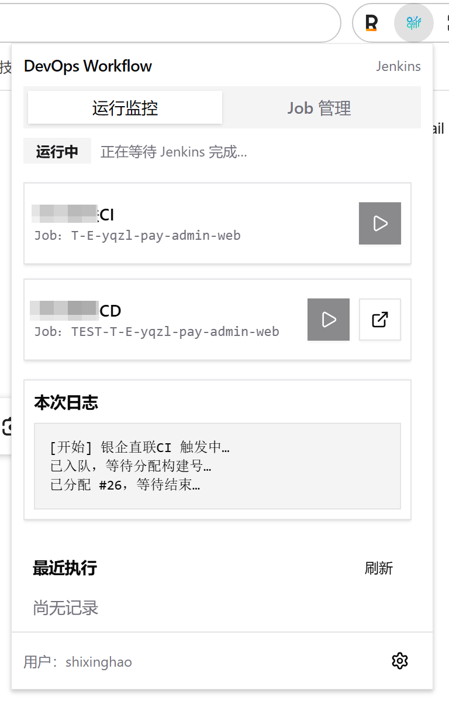
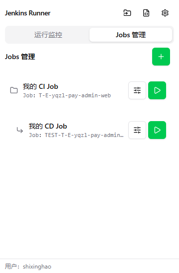
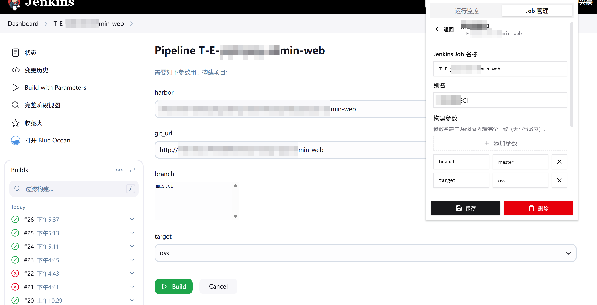
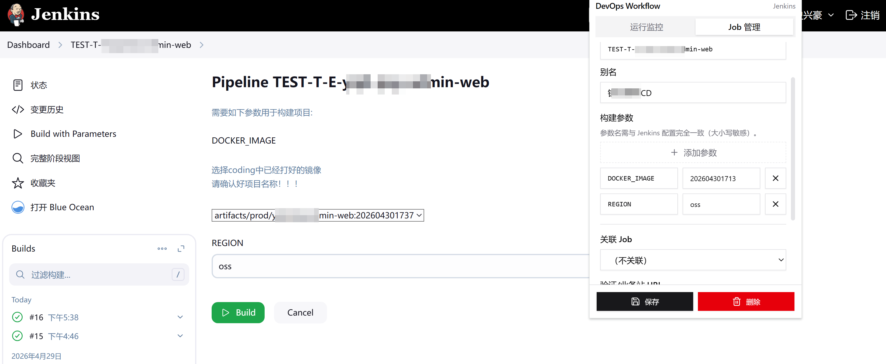
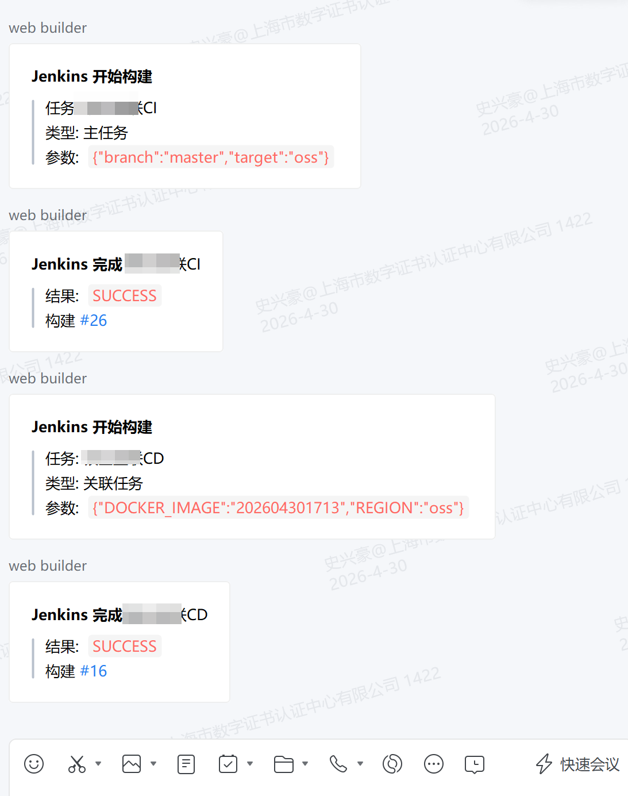

# devops-workflow

**Jenkins CI/CD 自动化构建插件**（浏览器扩展）：把常用 Jenkins Job 与参数保存下来，一键触发构建/发布，自动跟踪状态并聚合执行结果，减少反复登录 Jenkins、手工盯构建页面的成本。

## 你会得到什么

- **一键触发**：支持参数化构建（如 `branch` / 环境 / 发布方式等）。
- **状态跟踪**：自动轮询 Jenkins 任务状态，构建完成后给出成功/失败结果，并可快速跳转到构建详情页。
- **多 Job 管理**：按项目维护多条 Job 配置，随取随用。
- **更少的页面往返**：常用入口聚合在扩展里，不用在 Jenkins UI 里来回点。

> 安全提示：Jenkins Token 仅存扩展本地存储（`chrome.storage`），**不要**提交到仓库或写死在文档/代码里。

## 图片展示（`docs/`）

### 1）执行 Jenkins 的截图

### 2）Jenkins Job 配置截图

### 3）和 Jenkins CI 对比截图

### 4）和 Jenkins CD 对比截图

### 5）企微效果图

## 本地开发与加载扩展

1. 安装依赖：`pnpm install`
2. 构建产物：`pnpm run build`（输出到 `dist/`）
3. 在 Edge/Chrome 打开 `edge://extensions` 或 `chrome://extensions`，开启「开发人员模式」→ **加载已解压的扩展** → 选择本仓库的 `dist/` 目录
4. 点击工具栏扩展图标打开插件界面；需要大页面入口时，可在扩展详情页打开「扩展选项」（`options_page`）

开发过程中重复执行 `pnpm run build` 后，在扩展管理页点击「重新加载」即可更新。

## 配置说明（最小必需）

- **Jenkins 地址**：`JENKINS_URL`（例：`https://jenkins.example.com`）
- **鉴权**：`JENKINS_USER` + **API Token**（在 Jenkins 用户 Profile 创建，勿用登录密码长期替代）
- **Job**：填写 Jenkins Job 名称（与地址栏 `/job/` 后路径一致），并按需补充参数键值（大小写需与 Jenkins 参数名一致）
