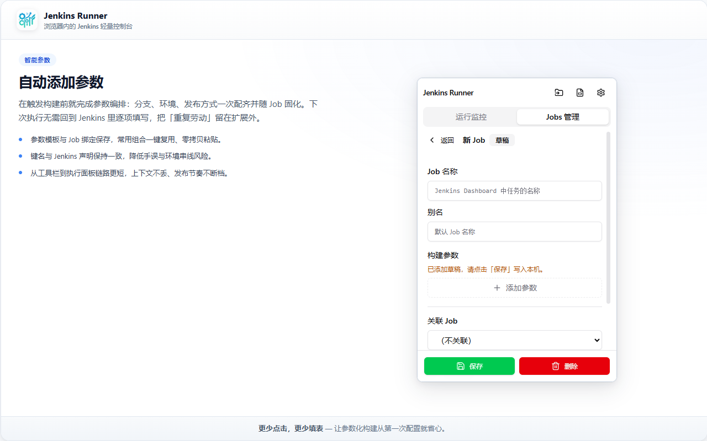
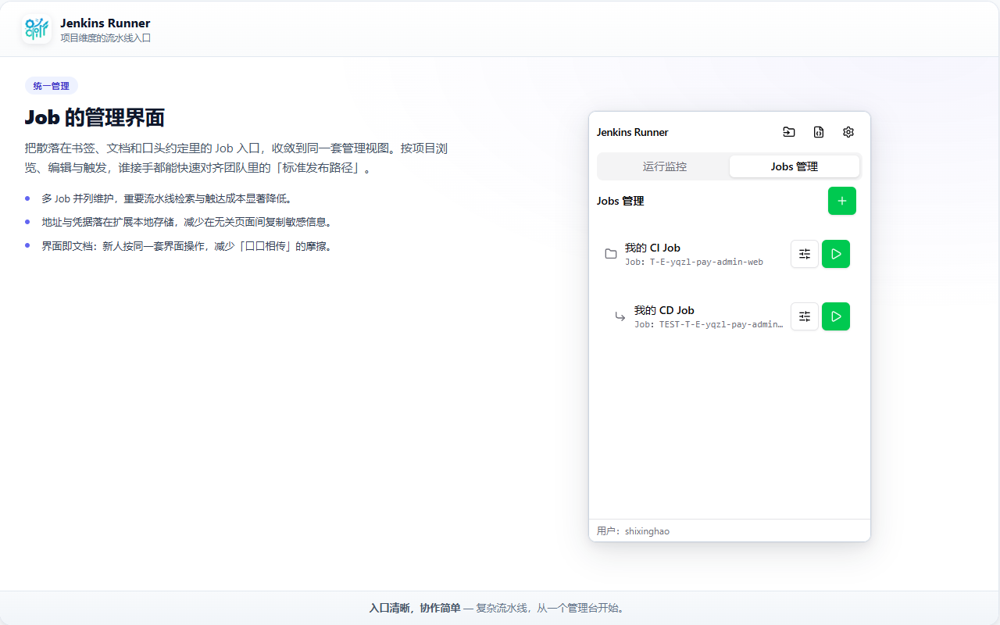
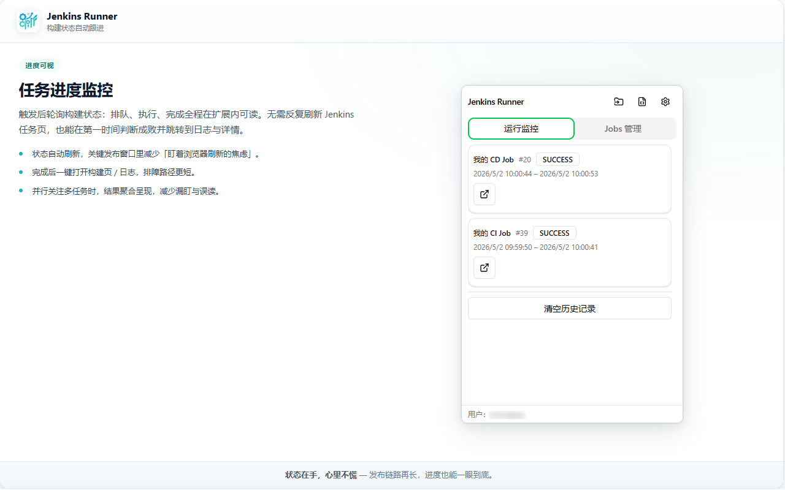

# jenkins-runner-extension

**Jenkins CI/CD 自动化构建插件**（浏览器扩展）：把常用 Jenkins Job 与参数保存下来，一键触发构建/发布，自动跟踪状态并聚合执行结果，减少反复登录 Jenkins、手工盯构建页面的成本。

## 你会得到什么

- **一键触发**：支持参数化构建（如 `branch` / 环境 / 发布方式等）。
- **状态跟踪**：自动轮询 Jenkins 任务状态，构建完成后给出成功/失败结果，并可快速跳转到构建详情页。
- **多 Job 管理**：按项目维护多条 Job 配置，随取随用。
- **更少的页面往返**：常用入口聚合在扩展里，不用在 Jenkins UI 里来回点。

> 安全提示：Jenkins Token 仅存扩展本地存储（`chrome.storage`），**不要**提交到仓库或写死在文档/代码里。

## 图片展示（`docs/`）

### 1）在 Jenkins 中创建 API Token（如何获取 Token）

在 Jenkins 网页右上角点击你的 **用户名** → **Configure（配置）**，在 **API Token** 区域点击 **Add new Token**，生成后复制保存；扩展「基础配置」里填写的 **用户** 与 **API Token** 须与此一致。勿将 Token 提交到仓库或发给他人。

### 2）Jenkins 主面板（运行监控）

打开 Jenkins 后，把 **浏览器地址栏里显示的站点根地址**（例如 `https://jenkins.example.com/` 或带上下文的 `https://ci.company.com/jenkins/`）记下来，填入扩展「基础配置」中的 **Jenkins 地址**，需与你在浏览器里访问 Jenkins 的 URL 一致（协议、域名、端口、路径前缀都要对上）。

### 3）新增 Job

### 4）管理 Job

### 5）运行 Job

## 本地开发与加载扩展

1. 安装依赖：`pnpm install`
2. 构建产物：`pnpm run build`（输出到 `dist/`）
3. 在 Edge/Chrome 打开 `edge://extensions` 或 `chrome://extensions`，开启「开发人员模式」→ **加载已解压的扩展** → 选择本仓库的 `dist/` 目录
4. 点击工具栏扩展图标打开插件界面；需要大页面入口时，可在扩展详情页打开「扩展选项」（`options_page`）

开发过程中重复执行 `pnpm run build` 后，在扩展管理页点击「重新加载」即可更新。

## 配置说明（最小必需）

- **Jenkins 地址**：`JENKINS_URL`（例：`https://jenkins.example.com`）
- **鉴权**：`JENKINS_USER` + **API Token**（在 Jenkins 用户 Profile 创建，勿用登录密码长期替代）
- **Job**：填写 Jenkins Job 名称（与地址栏 `/job/` 后路径一致），并按需补充参数键值（大小写需与 Jenkins 参数名一致）
